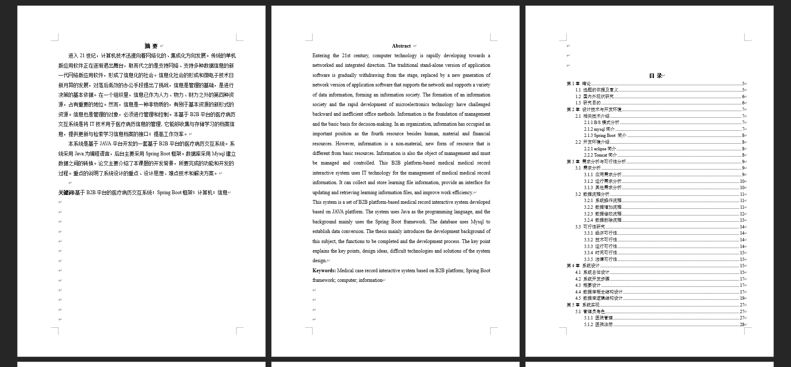
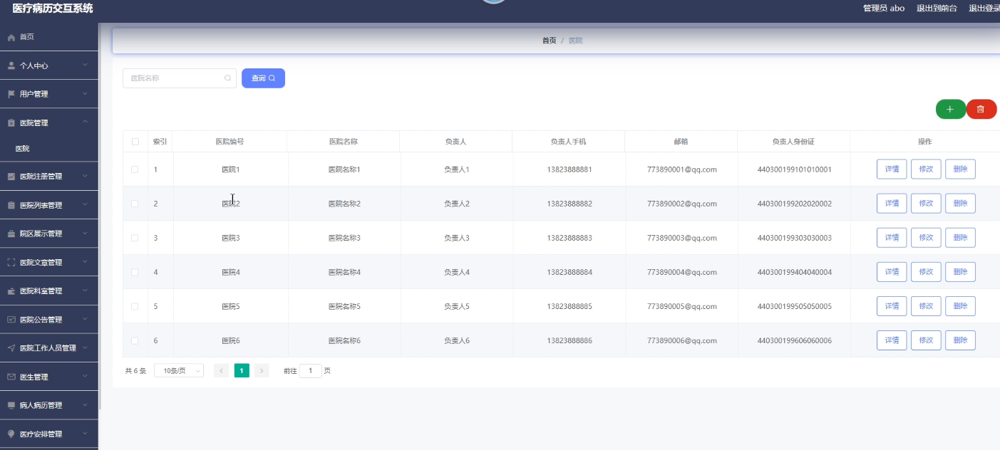
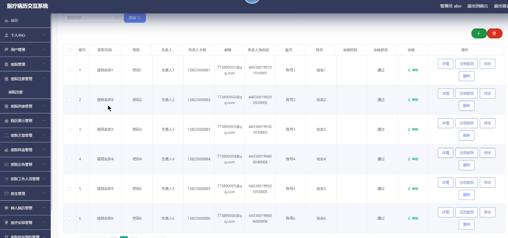
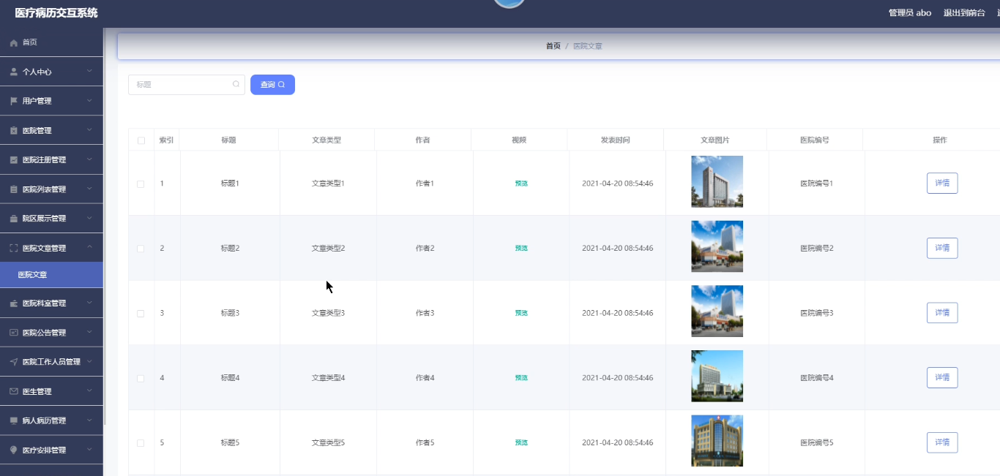
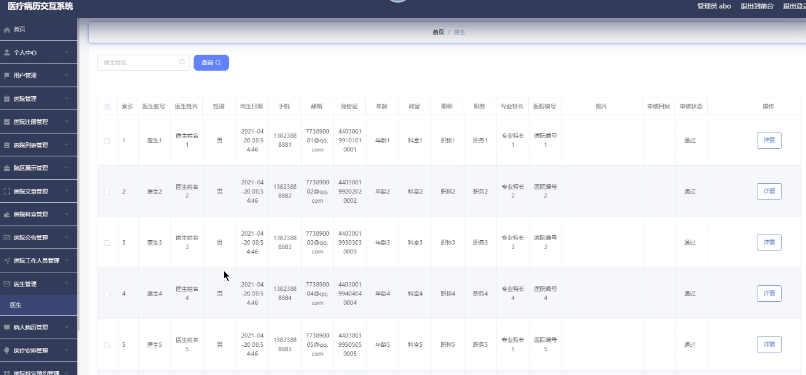
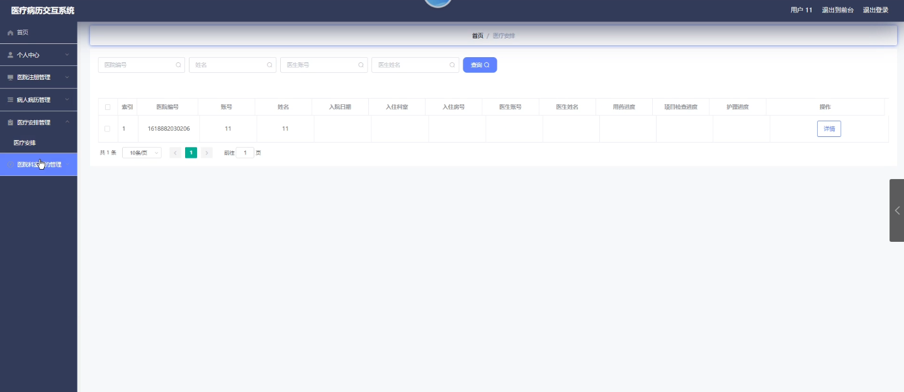
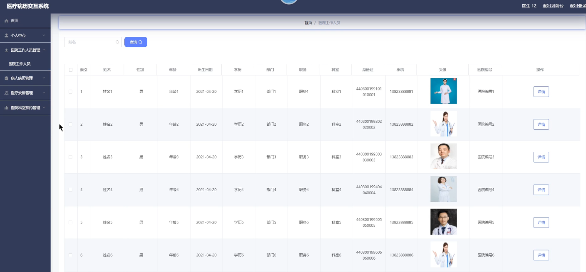
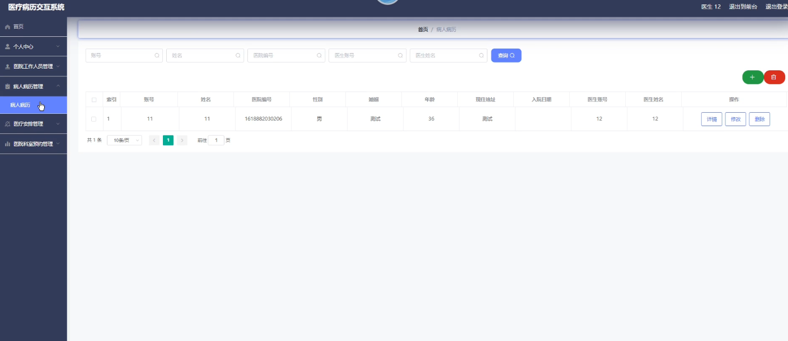

基于Springboot的医疗病历交互系统（程序+论文）
=
### 完整代码获取地址：从戎源码网 ([https://armycodes.com/](https://armycodes.com/))
### 作者微信：19941326836  QQ：952045282 
### 承接计算机毕业设计、Java毕业设计、Python毕业设计、深度学习、机器学习
### 选题+开题报告+任务书+程序定制+安装调试+论文+答辩ppt 一条龙服务
### 所有选题地址https://github.com/nature924/allProject

一、项目介绍
---
系统包含两种角色：用户、管理员，系统分为前台和后台两大模块，主要功能如下：
### 1管理员角色
- 医院管理: 管理员可以在医院管理界面执行添加、修改、删除和查询操作以管理医院信息。
- 医院注册: 管理员可以在医院注册界面对医院信息进行注册操作，包括添加、修改、删除和查询。
- 医院文章: 管理员可以在医院文章界面查看和查询医院相关的文章。
- 医生信息: 管理员可以在医生信息界面查看和查询医生的信息。

### 2用户角色
- 医院注册: 用户可以在医院注册界面对医院信息进行注册。
- 医疗安排: 用户可以在医疗安排界面查看医疗安排信息。

### 3 医院角色
- 院区注册: 医院可以在院区注册界面对院区信息进行注册操作。
- 医院公告: 医院可以在医院公告界面对公告信息进行添加、修改、删除和查询。

### 4 医生角色
- 医院工作人员: 医生可以在医院工作人员界面查看医院的工作人员信息。
- 病人病历: 医生可以在病人病历界面对病人的病历信息进行添加、修改、删除和查询。

二、项目技术
---
- 编程语言：Java
- 数据库：MySQL
- 项目管理工具：Maven
- 前端技术：VUE、HTML、Jquery、Bootstrap
- 后端技术：Spring、SpringMVC、MyBatis

三、运行环境
---
- 操作系统：Windows、macOS都可以
- JDK版本：JDK1.8以上都可以
- 开发工具：IDEA、Ecplise、Myecplise都可以
- 数据库: MySQL5.7以上都可以
- Tomcat：任意版本都可以
- Maven：任意版本都可以

四、运行截图
---
### 论文截图：

### 程序截图：

